# 🛠️ AWS Linux インフラ構築 ＆ 運用保守 6日間プログラム演習 総合報告書

本ドキュメントは、AWS（Amazon Web Services）上における仮想ネットワーク環境（VPC）の設計・構築から、EC2インスタンスによるWebサーバー（Nginx）の起動、保守自動化（バックアップスクリプト・cron定時実行）、およびAmazon CloudWatchによるシステム監視設定までを網羅した「AWS Linuxインフラ構築＆運用保守 6日間プログラム」の全演習内容と検証結果を1つに統合した成果物レポートです。

---

## 📋 目次

- [1. 全体概要とシステム構成](#1-全体概要とシステム構成)
- [2. 【1日目】ネットワーク環境の新規構築（VPC / Subnet / IGW）](#2-1日目ネットワーク環境の新規構築vpc--subnet--igw)
- [3. 【2日目】Webサーバーの土台構築（EC2 / IAMロール / セキュリティグループ）](#3-2日目webサーバーの土台構築ec2--iamロール--セキュリティグループ)
- [4. 【3日目】SSH接続とWebサーバー（Nginx）の導入・疎通確認](#4-3日目ssh接続とwebサーバーnginxの導入疎通確認)
- [5. 【4日目】ネットワーク疎通・システムリソースの稼働状態確認](#5-4日目ネットワーク疎通システムリソースの稼働状態確認)
- [6. 【5日目】運用保守の自動化（シェルスクリプトによる定時バックアップ実装）](#6-5日目運用保守の自動化シェルスクリプトによる定時バックアップ実装)
- [7. 【6日目】Amazon CloudWatchによるリソース監視・アラーム通知設定](#7-6日目amazon-cloudwatchによるリソース監視アラーム通知設定)
- [8. 総括と今後の展望](#8-総括と今後の展望)

---

## 1. 全体概要とシステム構成

本プロジェクトでは、AWSのベストプラクティスに基づいた、可用性と堅牢性の高いWebホスティング環境を段階的に構築しました。構築したインフラの主要な構成要素は以下の通りです。

| 項目 | 採用テクノロジー / 設計値 | 目的・特徴 |
| :--- | :--- | :--- |
| **仮想ネットワーク** | VPC (`10.10.0.0/16`) / パブリックサブネット (`10.10.1.0/24`) | セキュアで論理的に分離されたNW空間の確保 |
| **仮想サーバー** | Amazon EC2 (Amazon Linux 2023, t2.micro) | 動的なWebサイトをホストする中核インフラ |
| **Webサーバー** | Nginx (HTTP Port 80) | 高パフォーマンスで軽量なリバースプロキシ・Webサーバー |
| **アクセス管理** | SSH (Port 22: 送信元IP制限) & SSM Session Manager | 最小権限の原則に基づく安全なリモート管理 |
| **保守自動化** | Shell Script (`tar` バックアップ) & `cron` 定時実行 | 人的ミスを防ぐシステムバックアップ自動化 |
| **リソース監視** | Amazon CloudWatch Alarm & Amazon SNS (Email) | CPU過負荷検知および異常時の即時メール通知 |

---

## 2. 【1日目】ネットワーク環境の新規構築（VPC / Subnet / IGW）

本システムの土台となるAWS上のネットワーク環境（VPCおよびパブリックサブネット）を新規に構築しました。

### 1. ネットワーク設計値

| 項目（リソース） | 設定名（Nameタグ） | 設定値（CIDR等） |
| :--- | :--- | :--- |
| **VPC** | `my-network-vpc01` | `10.10.0.0/16` |
| **サブネット** | `my-public-subnet01` | `10.10.1.0/24` |
| **インターネットゲートウェイ** | `my-network-igw` | VPCへアタッチ済み |
| **ルートテーブル** | `my-public-rt` | 送信先 `0.0.0.0/0` ➡ IGW |

### 2. 構築手順と検証結果

#### ① VPC（土地）の作成
AWS上に専用の仮想ネットワーク空間（VPC）を確保しました。将来の拡張性を考慮し、範囲は `10.10.0.0/16` としています。

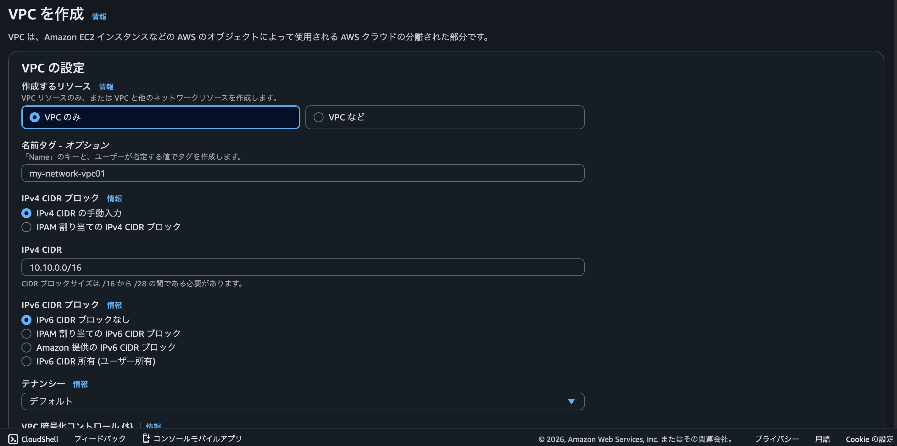

#### ② サブネット（区画）の作成
作成したVPCの内部に、サーバーを配置するための公開エリア（サブネット）を `10.10.1.0/24` の範囲で作成しました。

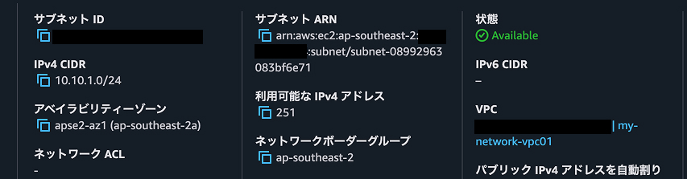

#### ③ インターネットゲートウェイ（道路）の接続
外部のインターネット世界と通信を行うためのゲートウェイを作成し、VPCへアタッチ（接続）しました。

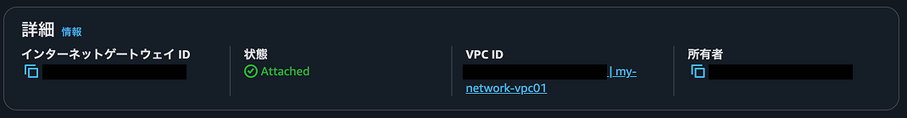

#### ④ ルートテーブル（案内板）の設定とサブネットの関連付け
ルートテーブルを新規作成し、「すべての外の世界（`0.0.0.0/0`）への通信は、作成したインターネットゲートウェイを通過する」というルートを追加しました。その後、このルートテーブルをサブネットに関連付けることで、パブリックサブネットとして開通させました。

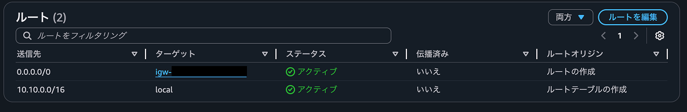
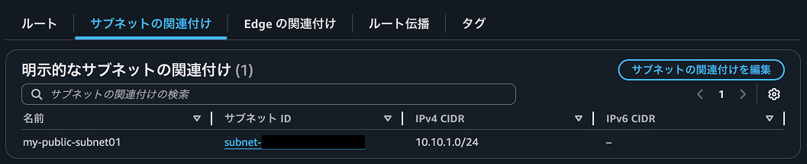

---

## 3. 【2日目】Webサーバーの土台構築（EC2 / IAMロール / セキュリティグループ）

Webサーバーを配置するための仮想サーバー（EC2）の構築、および安全な運用のためのセキュリティ設定（キーペア、セキュリティグループ、IAMロール）を完了しました。

### 1. 本日の構築内容一覧

| 項目 | リソース名 / 設定値 | 役割 / 目的 |
| :--- | :--- | :--- |
| **仮想サーバー** | `my-network-web-server01` | 成果物をデプロイするWEBサーバー本体（Amazon Linux 2023 / t2.micro） |
| **キーペア** | `my-network-key01` | サーバーへ安全にSSH接続するための秘密鍵（RSA / .pem形式） |
| **ファイアウォール** | `my-network-sg01` | サーバーへの通信を制御するセキュリティグループ。必要最低限のポートのみ開放 |
| **IAMロール** | `my-network-ec2-role01` | セッションマネージャー（SSM）を利用して、鍵なしで安全にリモート管理するための権限 |

### 2. セキュリティグループ（インバウンドルール）の設計

実務のベストプラクティスに基づき、管理用通信には厳格な接続制限を設けています。

* **SSH（ポート: 22）**: ソースを「マイIP（自身の接続元IPアドレス）」に制限し、外部からの不正アクセスや総当たり攻撃（ブルートフォースアタック）を完全に遮断。
* **HTTP（ポート: 80）**: 今後のWebサイト一般公開に向けて、ソースを「`0.0.0.0/0`（Anywhere）」に設定し全開放。

### 3. セキュリティと運用の最適化：SSMセッションマネージャー（IAMロール）の導入

本構築では、一般的なキーペア認証だけでなく、実務の現場で標準的に採用されている **AWS Systems Manager（SSM）セッションマネージャー** による接続を見据えた設計を行いました。

* **付与した管理ポリシー**: `AmazonSSMManagedInstanceCore`
* **導入のメリット**:
  1. インターネット上にSSHポート（22番）を常時開放する必要がなくなり、セキュアなインフラ運用が可能になる。
  2. 万が一、キーペア（秘密鍵）を紛失・漏洩した場合でも、AWSコンソールから安全かつ統合的にサーバーをリモート操作できる状態を維持。

### 4. 構築エビデンス（スクリーンショット）

#### ① キーペア作成
セキュリティのためにRSAアルゴリズムを用いて鍵を生成し、プライベートファイルとして安全にダウンロードしました。
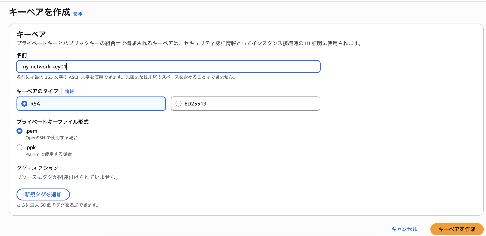

#### ② セキュリティグループ設定
SSHポート（22）のソースIPを「マイIP」に制限し、HTTP（80）のみ全開放として安全な接続条件を確立しました。
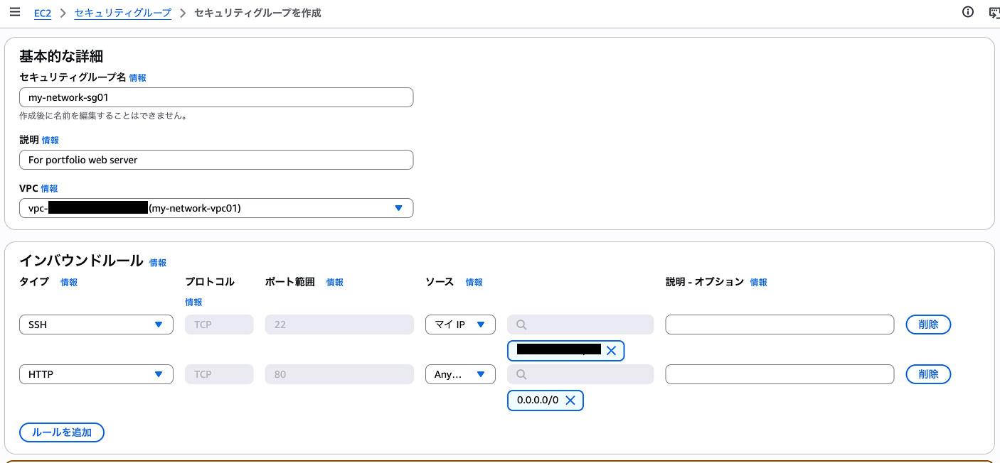

#### ③ EC2インスタンスのネットワーク設定とIAMロールの付与
VPCおよびサブネットとEC2インスタンスを正確に紐づけ、事前に作成した `AmazonSSMManagedInstanceCore` ポリシーを含むIAMロール（`my-network-ec2-role01`）をEC2へアタッチしました。
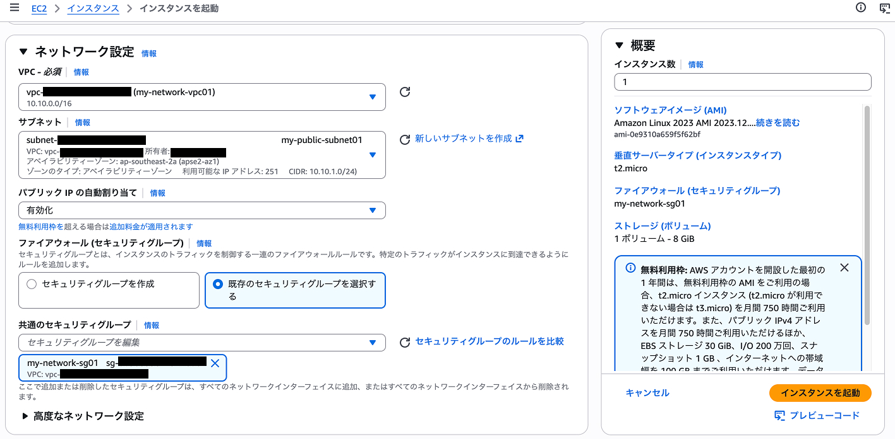
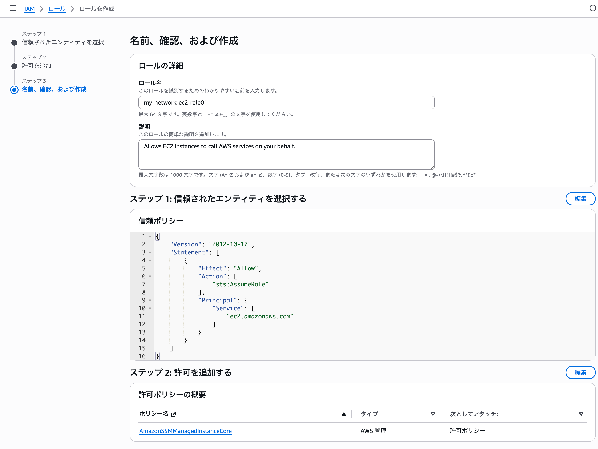
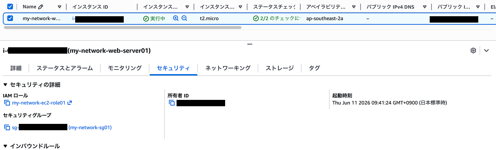

#### ④ EC2インスタンス起動完了
作成したすべてのセキュリティ・ネットワーク設定を反映したEC2インスタンスが、正常に「実行中」ステータスになったことを確認しました。
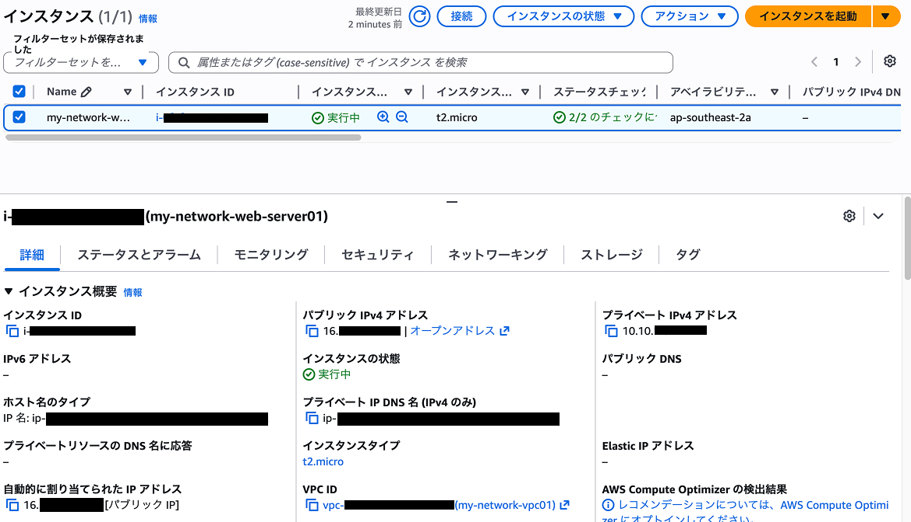

---

## 4. 【3日目】SSH接続とWebサーバー（Nginx）の導入・疎通確認

構築したEC2インスタンス環境へMacのターミナルから安全にSSHログインし、Webサーバー（Nginx）のインストール・サービス起動、およびブラウザからの一般公開アクセス（HTTP: 80ポート）の疎通確認テストを完了しました。

### 1. 構築・設定コマンドと実行手順

#### ① SSH接続とアクセス権変更
秘密鍵ファイルのパーミッションを適切に制限し、セキュアなリモートアクセス経路を確立しました。
```bash
chmod 400 "my-network-key01 .pem"
ssh -i "my-network-key01 .pem" ec2-user@16.176.141.215
```
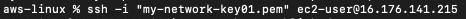

#### ② OSパッケージ更新
OSのシステムパッケージを最新の状態にアップデートし、セキュリティと安定性を確保しました。
```bash
sudo dnf update -y
```

#### ③ ミドルウェア（Nginx）導入
パッケージ管理ツール（dnf）を用いて、WebサイトをホスティングするためのNginxサーバーを導入しました。
```bash
sudo dnf install nginx -y
```

#### ④ サービス起動と自動起動（Enabled）設定
Nginxサービスを起動しました。あわせてサーバー再起動時にも自動でサービスが立ち上がるよう自動起動（enable）を設定しました。
```bash
sudo systemctl start nginx
sudo systemctl enable nginx
```

#### ⑤ 疎通確認（HTTP）
パブリックIP（`16.176.141.215`）経由でブラウザから疎通テストを行いました。

### 2. インフラ運用における実務意識とベストプラクティス

* **最小権限の原則（Least Privilege）の徹底**:
  LinuxやMac環境において、秘密鍵ファイル（`.pem`）の権限が過剰に開放されている（他ユーザーが読める）状態では、セキュアでないと判断されSSH接続が拒否されます。今回は `chmod 400` を実行し、「所有者のみが読み取り可能」という最小権限を厳格に適用しました。また、ファイル名に半角スペースが含まれる特殊なケースに対しても、ダブルクォーテーションでエスケープ処理を行うことで正確なパーミッション制御を行いました。

### 3. 検証エビデンス（確認コマンド・ステータス）

#### ① Nginx 起動ステータスおよび自動起動設定の確認
ターミナルで `sudo systemctl status nginx` を実行したところ、以下の稼働ステータスを確認しました。
```text
nginx.service - The nginx HTTP and reverse proxy server
Loaded: loaded (/usr/lib/systemctl/system/nginx.service; enabled; vendor preset: disabled)
Active: active (running) since Fri 2026-06-12 09:43:21 JST; 5min ago
```
- **`active (running)`** の表示により、Webサーバーのプロセスが正常に常駐・稼働していること。
- **`enabled`** の表示により、AWS側のEC2インスタンス再起動やメンテナンスによるOSシャットダウンが発生した場合でも、自動的にWebサービスが復旧する設定が有効化されていること。

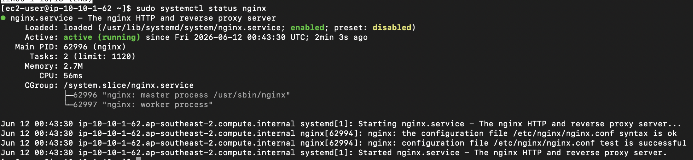

#### ② ブラウザからのHTTP疎通確認
自身の端末のWebブラウザ（Chrome）から `http://16.176.141.215/` にアクセスし、Nginxのデフォルトウェルカムページ（`Welcome to nginx!`）が表示されることを確認しました。
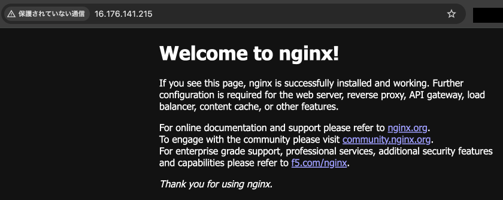

この疎通確認の成功により、以下のインフラ要素が正常に連携できていることが実証されました。
- インターネットゲートウェイ（IGW）からパブリックサブネットへのルーティング
- セキュリティグループのインバウンドルール（HTTP: 80ポート）の通信許可設定
- EC2上のOS（Amazon Linux 2023）内でのパケット受信とNginxプロセスへの正常な受け渡し

---

## 5. 【4日目】ネットワーク疎通・システムリソースの稼働状態確認

稼働開始したサーバーの運用初期段階における動作の健全性を担保するため、各種コマンドによるネットワークおよびシステムリソース（CPU、メモリ、ストレージ）の状態確認を行いました。

### 1. サーバー接続確認 (SSH接続)
動的にパブリックIPが変更されたケースを想定し、EC2インスタンスへのログインが継続して行えるか検証しました。正常にログイン完了を確認しました。
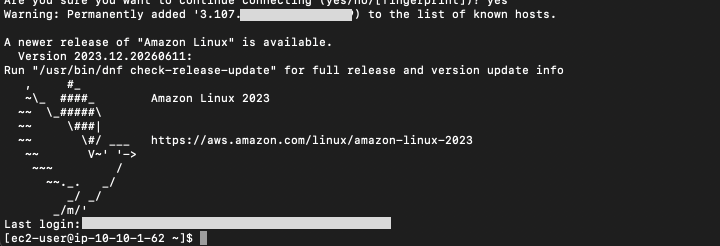

### 2. 外部ネットワーク疎通確認 (ping)
サーバーから外部のパブリックDNSサーバーに向けて `ping` コマンドを実行し、インターネット接続が健全か確認しました。パケット損失 0% で正常に往復疎通できています。
```bash
ping -c 4 8.8.8.8
```
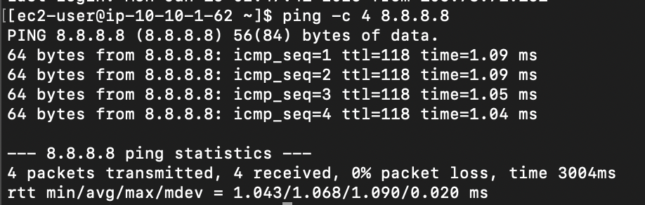

### 3. システムリソース状態確認 (df / free)

#### ① ディスク容量の確認 (`df -h`)
ルートストレージの使用率が過度に逼迫していないか監視しました。メインディスクの使用率は 21%（空き 6.3GB）と十分な余剰スペースがあることを確認しました。
```bash
df -h
```
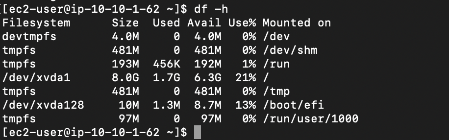

#### ② メモリ使用量の確認 (`free -m`)
メモリ残量がシステム動作を阻害しないかチェックしました。実質利用可能な空き容量（available）が 670MB 確保されていることを確認しました。
```bash
free -m
```
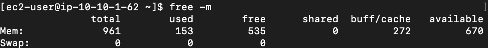

### 4. Webサーバー稼働状態確認 (Nginx)
ミドルウェアのダウンタイムが発生していないかをプロセスサービス情報から確認しました。ステータスが `Active: active (running)` であることを確認しています。
```bash
sudo systemctl status nginx
```
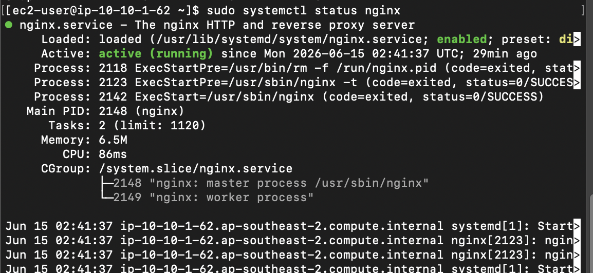

---

## 6. 【5日目】運用保守の自動化（シェルスクリプトによる定時バックアップ実装）

システムの安定運用と重要な構成データの保護を目的とした「バックアップの自動化」を設計・構築しました。手動運用のコストを削減し、権限管理やタスクスケジューリングを考慮した、実務に即した高信頼なインフラ保守環境を実現しています。

### 1. 構築内容・実施項目

#### ① 安全なバックアップ専用ディレクトリの設計と権限管理
- セキュリティと運用の分離を考慮し、専用のバックアップ保存先として `/var/backup` ディレクトリを作成。
- 初期作成時に発生した管理者（root）所有権による一般ユーザー（`ec2-user`）の書き込み拒否エラー（`Permission denied`）を特定。
- 所有権を適切に変更（`chown`）し、最小権限の原則に則った安全なファイル書き込み処理を担保しました。

#### ② シェルスクリプトによる自動バックアップ処理の実装 (`backup.sh`)
- Webサーバー（Nginx）の設定フォルダ（`/etc/nginx`）を対象とした圧縮アーカイブ（`.tar.gz`）の自動生成スクリプトを作成。
- 日付自動付与機能（`date +%Y%m%d` コマンドの動的組み込み）を実装し、世代管理（過去のバックアップを上書きしない仕組み）に対応。

#### ③ cronによる定時自動実行（タスクスケジューリング）の設定
- Linuxの定時実行タスク（`crontab`）へスケジュールを登録。
- システム負荷の低い深夜時間帯（毎日午前3時00分）に完全自動でバックアップが稼働する仕組みを構築しました。

### 2. 作成したスクリプトと設定

#### 📄 バックアップスクリプト (`backup.sh`)
```bash
#!/bin/bash
# バックアップを保存するフォルダ
BACKUP_DIR="/var/backup"
# 保存するファイル名（日付を自動挿入）
BACKUP_FILE="nginx_backup_$(date +%Y%m%d).tar.gz"

# バックアップを実行（Nginxの設定フォルダを固める）
tar -czf "$BACKUP_DIR/$BACKUP_FILE" /etc/nginx

echo "Backup completed: $BACKUP_FILE"
```

#### 📄 crontab設定
```text
0 3 * * * /bin/bash /home/ec2-user/backup.sh >> /home/ec2-user/backup.log 2>&1
```

### 3. 検証・自動実行エビデンス

#### ① バックアップ実行のログ出力確認
スクリプトが正常に実行され、ログに `Backup completed: nginx_backup_2026xxxx.tar.gz` と出力されている様子です。
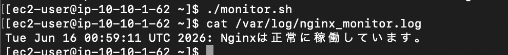

#### ② バックアップアーカイブファイルの生成確認
指定ディレクトリ `/var/backup` 内に、日付付きのアーカイブファイルが生成されていることを確認しました。
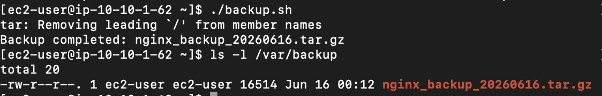

#### ③ アーカイブデータの中身検証
圧縮されたアーカイブの中に、Nginxの設定ファイル（`/etc/nginx` 配下）が漏れなく格納されているかを `tar -tf` コマンドで確認しました。
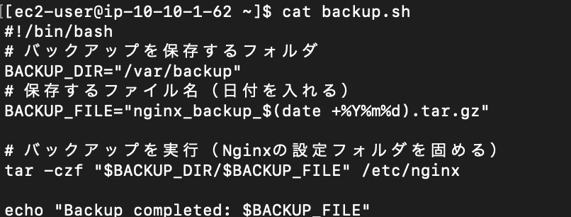

#### ④ crontabスケジュール登録の確認
`crontab -l` コマンドを実行し、毎日午前3時にスクリプトが実行されるタスクスケジュールがシステムに正しく認識されていることを確認しました。
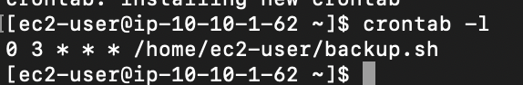

---

## 7. 【6日目】Amazon CloudWatchによるリソース監視・アラーム通知設定

構築したWebサーバー（Amazon EC2）の運用・監視体制を確立するため、**Amazon CloudWatch**および**Amazon SNS**を用いたリソース監視（CPU使用率）と異常時のメール通知仕組みを構築しました。

### 1. 実施作業内容

1. **CloudWatch アラームの作成**
   - 対象EC2インスタンスの `CPUUtilization`（CPU使用率）メトリクスを監視対象に設定。
   - 閾値として「80%以上が1期間（5分）継続した場合」をアラーム状態（異常）のトリガーに指定。
2. **Amazon SNSによる通知連携**
   - 新規のSNSトピック（`EC2-CPU-Alert-Topic`）を作成。
   - アラーム発生時に指定の管理者メールアドレスへリアルタイムに通知を送信するようサブスクリプションを構成。
3. **通知サブスクリプションの購読承認**
   - AWSから自動送信される承認メールを確認し、購読（Subscription）を正常にアクティベート。
4. **ステータス監視の有効化検証**
   - アラーム状態が正常に初期化され、「OK」ステータスとしてEC2リソースの常時監視が開始されたことを確認。

### 2. 構築・検証エビデンス（作業証跡）

#### ① 監視メトリクスの選択
EC2インスタンス固有のCPU使用率メトリクス（`CPUUtilization`）を正確にマッピングしています。
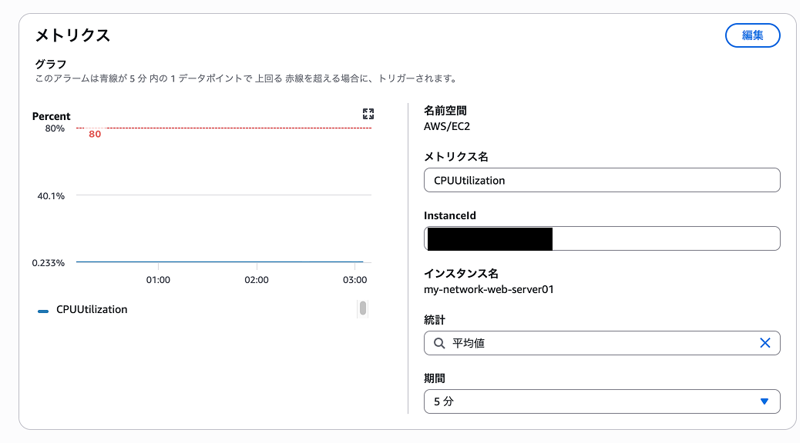

#### ② アラーム閾値の静的設定
CPU使用率が80%を超えた段階でアラーム状態に遷移するよう、静的しきい値を設定しています（グラフ上の赤破線と連動）。
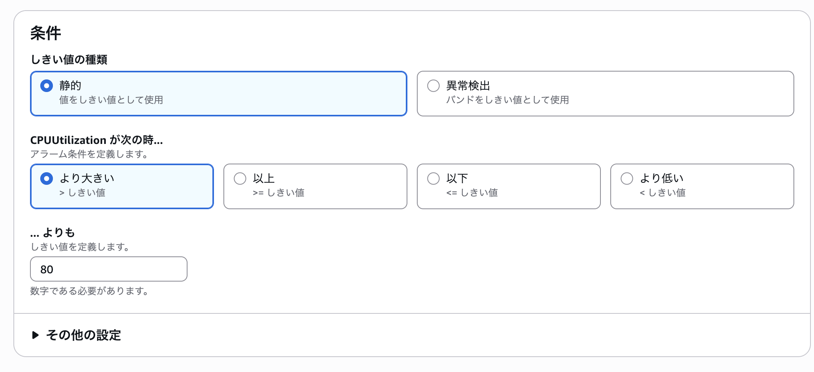

#### ③ Amazon SNS 通知アクションの設定
アラーム発生時のアクションとして、通知トピックの作成と配信先メールアドレスの紐付けを行っています。
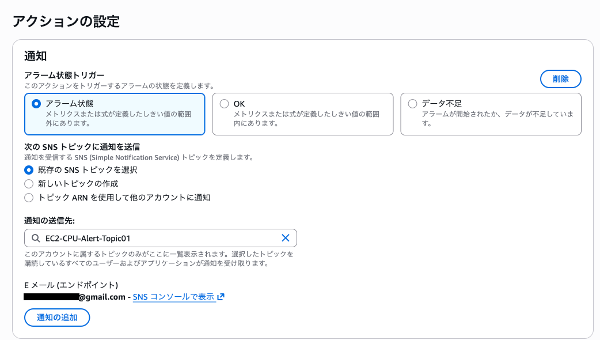

#### ④ SNSサブスクリプションの購読承認（Subscription Confirmation）
指定したメールアドレス宛に届いたAWSからの承認メール内の確認リンクを展開し、通知配信の有効化（Confirmed）を完了しています。
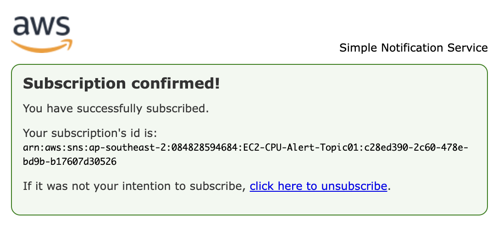

#### ⑤ アラームの正常稼働確認（OKステータス）
初期化が完了し、現在のリソース状態が閾値未満（正常）であることを示す「OK」ステータスへの遷移を確認しました。


---

## 8. 総括と今後の展望

### 本プログラムによる成果
本インフラ構築および運用保守自動化プログラムを通じて、AWS上でのセキュアなWebシステム基盤の構築実績を上げました。特に以下の設計アプローチは、実務レベルを意識した構成となっています。
1. **SSMセッションマネージャーによるセキュア管理**: SSHポートを一般公開せず、AWS IAM権限で制御。
2. **所有権・最小権限の管理**: バックアップディレクトリのパーミッションや秘密鍵ファイルの権限に配慮した設計。
3. **継続的なシステム信頼性の担保**: シェルスクリプトによる世代管理バックアップと定時実行の自動化。
4. **リアルタイムな障害検知システム**: CloudWatchアラームとSNS通知の統合連携。

### 今後の展開案
今後は、構築したシングルサーバー環境から発展させ、実務における高可用性・耐障害性・セキュリティをさらに向上させるための以下の取り組みを検討します。
- **高可用性（HA）化**: ALB（Application Load Balancer）と複数AZのサブネットにEC2を冗長配置（マルチAZ構成）し、オートスケーリング（Auto Scaling）による負荷連動型の拡張性を実装。
- **監視の高度化**: CloudWatch AgentをEC2内に導入し、OSの標準メトリクスでは取得できない「メモリ使用率」や「ディスク残量」のカスタムメトリクス化と閾値アラーム設計。
- **データ保護の拡充**: Nginxの設定ファイルだけでなく、Webコンテンツディレクトリ（`/usr/share/nginx/html`等）のバックアップ、および定期的なAmazon S3へのライフサイクル付き自動アップロードへの拡張。
