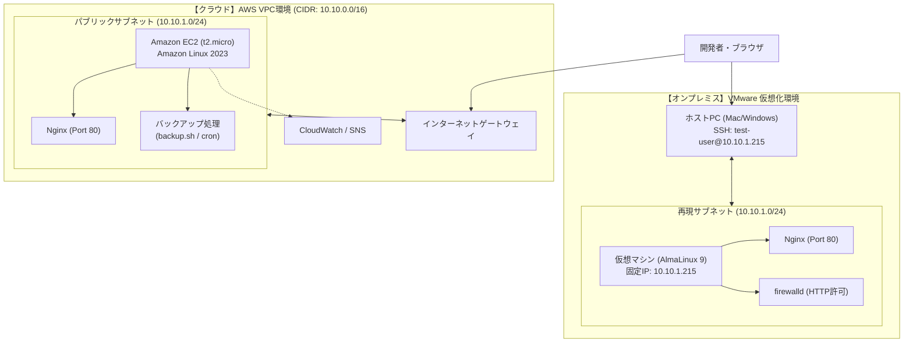

# 🚀 Webインフラ構築・運用保守 総合ポートフォリオ
## 〜 AWSクラウド ＆ オンプレミス（仮想化）ハイブリッド検証レポート 〜

本ドキュメントは、AWS（Amazon Web Services）環境での設計・構築と運用保守自動化の実績、およびそれらをローカル（オンプレミス）の仮想化環境（VMware / AlmaLinux 9）上で高精度に再現・比較検証したハイブリッドインフラ構築プロジェクトの全容を1つに統合した成果物レポートです。

---

## 📋 目次

- [1. 全体概要とプロジェクト目的](#1-全体概要とプロジェクト目的)
  - [1.1 プロジェクト概要](#11-プロジェクト概要)
  - [1.2 インフラ全体構成図（ハイブリッド構成）](#12-インフラ全体構成図ハイブリッド構成)
  - [1.3 クラウドとオンプレミスの機能対比表](#13-クラウドとオンプレミスの機能対比表)
  - [1.4 AWSクラウド環境の主要設計値](#14-awsクラウド環境の主要設計値)
  - [1.5 オンプレミス（仮想化）環境での検証目的](#15-オンプレミス仮想化環境での検証目的)
- [2. AWSクラウド環境の設計・構築](#2-awsクラウド環境の設計構築)
  - [2.1 ネットワーク環境の新規構築（VPC / Subnet / IGW）](#21-ネットワーク環境の新規構築vpc--subnet--igw)
  - [2.2 Webサーバーの土台構築とセキュリティ設定（EC2 / IAMロール / SG）](#22-webサーバーの土台構築とセキュリティ設定ec2--iamロール--sg)
  - [2.3 SSH接続とWebサーバー（Nginx）の導入・疎通確認](#23-ssh接続とwebサーバーnginxの導入疎通確認)
  - [2.4 ネットワーク疎通・システムリソースの稼働状態確認](#24-ネットワーク疎通システムリソースの稼働状態確認)
  - [2.5 運用保守の自動化（シェルスクリプトによる定時バックアップ実装）](#25-運用保守の自動化シェルスクリプトによる定時バックアップ実装)
  - [2.6 Amazon CloudWatchによるリソース監視・アラーム通知設定](#26-amazon-cloudwatchによるリソース監視アラーム通知設定)
- [3. オンプレミス（VMware）環境における再現・比較検証](#3-オンプレミスvmware環境における再現比較検証)
  - [3.1 ネットワーク設計および全体構成](#31-ネットワーク設計および全体構成)
  - [3.2 各ステップの構築手順と実施内容](#32-各ステップの構築手順と実施内容)
- [4. 総括とハイブリッド環境における習得スキル](#4-総括とハイブリッド環境における習得スキル)
  - [4.1 本プロジェクトの成果と設計意図](#41-本プロジェクトの成果と設計意図)
  - [4.2 証明される習得スキル](#42-証明される習得スキル)
  - [4.3 今後の展望](#43-今後の展望)

---

# 1. 全体概要とプロジェクト目的

## 1.1 プロジェクト概要
本プロジェクトでは、AWS上における仮想ネットワーク環境（VPC）の設計・構築から、EC2インスタンスによるWebサーバー（Nginx）の起動、保守自動化（バックアップスクリプト・cron定時実行）、およびAmazon CloudWatchによるシステム監視設定までを網羅した「AWSクラウドインフラ環境」を構築。

さらに、クラウド環境での設計思想をローカル（オンプレミス）の仮想化環境（VMware / AlmaLinux 9）上でシミュレーションし、クラウドとオンプレミスのハイブリッド環境におけるインフラ構築・運用の比較検証を実施しました。

## 1.2 インフラ全体構成図（ハイブリッド構成）

本プロジェクトで構築・検証したインフラの全体構成図です。AWS上のVPC環境と、VMware上の仮想化環境における設計的・技術的な対応関係を示しています。



## 1.3 クラウドとオンプレミスの機能対比表

AWSクラウド上の各インフラ構成要素と、オンプレミス（VMware）環境における技術的対応関係の一覧です。両環境の設計思想と差異を体系的に比較しています。

| 比較項目 | AWSクラウド環境 | オンプレミス（VMware）環境 | 技術的ポイント・設計意図 |
| :--- | :--- | :--- | :--- |
| **仮想化ホスト** | AWSマネージドインフラ | VMware Workstation (ローカル) | クラウドプロバイダ管理とローカルハイパーバイザの違い |
| **OS** | Amazon Linux 2023 | AlmaLinux 9.x | RedHat系・dnfパッケージ管理の親和性を担保 |
| **仮想ネットワーク** | VPC (Subnet: `10.10.1.0/24`) | VMware NATモード (Subnet: `10.10.1.0/24`) | クラウドVPCのIP設計をオンプレミス環境で忠実に再現 |
| **外部通信経路** | インターネットゲートウェイ (IGW) | 仮想ネットワークエディタ (NATゲートウェイ) | 外部とのインターネット接続およびルーティング制御 |
| **ファイアウォール** | セキュリティグループ (SG) | `firewalld` (OS内蔵) | クラウドの境界型防御とホストOS内部防御の対比 |
| **リモート管理** | SSM Session Manager / SSH | SSH接続 (一般ユーザー制限) | ルート直接ログインの禁止など、アクセス制限の徹底 |
| **Webサーバー** | Nginx (HTTP Port 80) | Nginx (HTTP Port 80) | 同一ミドルウェアを用いた稼動状況・設定プロセスの検証 |

## 1.4 AWSクラウド環境の主要設計値

| 項目 | 採用テクノロジー / 設計値 | 目的・特徴 |
| :--- | :--- | :--- |
| **仮想ネットワーク** | VPC (`10.10.0.0/16`) / パブリックサブネット (`10.10.1.0/24`) | セキュアで論理的に分離されたNW空間の確保 |
| **仮想サーバー** | Amazon EC2 (Amazon Linux 2023, t2.micro) | 動的なWebサイトをホストする中核インフラ |
| **Webサーバー** | Nginx (HTTP Port 80) | 高パフォーマンスで軽量なリバースプロキシ・Webサーバー |
| **アクセス管理** | SSH (Port 22: 送信元IP制限) & SSM Session Manager | 最小権限の原則に基づく安全なリモート管理 |
| **保守自動化** | Shell Script (`tar` バックアップ) & `cron` 定時実行 | 人的ミスを防ぐシステムバックアップ自動化 |
| **リソース監視** | Amazon CloudWatch Alarm & Amazon SNS (Email) | CPU過負荷検知および異常時の即時メール通知 |

## 1.5 オンプレミス（仮想化）環境での検証目的
AWS環境の専用OS「Amazon Linux 2023」の再現として、パッケージ構成やベースシステムが極めて近い「AlmaLinux 9」を採用。AWS側のVPC設計（`10.10.1.0/24`）をローカル側で完全にシミュレートし、固定IPアドレスの割り当て、ホストPCからの安全なSSHリモート接続、およびOS内ファイアウォールを制御したWebサーバー（Nginx）の導入までを実証しました。これにより、クラウドとオンプレミス双方のインフラ特性を深く理解し、適材適所のシステム設計ができる能力を養うことを目的としています。

---

# 2. AWSクラウド環境の設計・構築

## 2.1 ネットワーク環境の新規構築（VPC / Subnet / IGW）
システム基盤となるパブリックサブネット含むVPC環境をAWS上に構築しました。

* **設計値**：VPC: `my-network-vpc01` (`10.10.0.0/16`) / サブネット: `my-public-subnet01` (`10.10.1.0/24`)

#### ① VPC（仮想ネットワーク空間）の作成
将来の拡張性を考慮し、IPアドレス範囲 `10.10.0.0/16` にてVPCを新規作成。


#### ② パブリックサブネットの作成
仮想サーバーを配置するため、VPC内にCIDR範囲 `10.10.1.0/24` のパブリックサブネットを切り出し。


#### ③ インターネットゲートウェイ（IGW）の接続
VPC内部から外部インターネットと双方向通信を行うためのIGWを作成し、VPCにアタッチ。


#### ④ ルートテーブルの構成とサブネットの関連付け
ルートテーブルを新規作成し、デフォルトルート（`0.0.0.0/0`）の送信先としてIGWを指定。この設定をサブネットに関連付けることで、インターネット接続可能なパブリックサブネットとして有効化。


---

## 2.2 Webサーバーの土台構築とセキュリティ設定（EC2 / IAMロール / SG）
WebサーバーをホストするためのEC2インスタンスを起動し、アクセス制御および管理用の設定を適用しました。

#### ① SSH接続キーペアの作成
安全なリモート管理を実現するため、RSA暗号方式（`.pem`形式）のキーペア `my-network-key01` を作成。


#### ② セキュリティグループ（ファイアウォール）の設計とインバウンド制限
管理アクセス（SSH: 22番ポート）の送信元を自身の接続元IPアドレス（マイIP）に限定し、外部からの不正アクセス経路を完全に遮断。一般公開用のHTTP（80番ポート）は全開放（`0.0.0.0/0`）に設定。


#### ③ EC2インスタンスの作成とネットワークアタッチ
事前に定義したVPC・パブリックサブネットのネットワーク設定とセキュリティグループを適用し、Amazon Linux 2023（t2.micro）のEC2インスタンスを起動。


#### ④ セキュアリモート管理（SSMセッションマネージャー）のためのIAMロールの付与
インターネット上に管理ポート（22番）を常時開放するリスクを排除するため、AWS Systems Managerによるセキュアなリモート接続を可能にするポリシー `AmazonSSMManagedInstanceCore` を付与したIAMロールをEC2にアタッチ。


#### ⑤ 仮想サーバー（EC2）の起動確認
設定が完了し、EC2インスタンスが正常に「実行中」ステータスになったことを確認。


---

## 2.3 SSH接続とWebサーバー（Nginx）の導入・疎通確認
作成したEC2インスタンスへ接続し、Webサーバーパッケージ（Nginx）の導入とWeb公開疎通の検証を行いました。

#### ① SSH接続の実行
ダウンロードした秘密鍵ファイルのアクセスパーミッションを `chmod 400`（所有者のみ読み取り可能）へ厳格に変更し、EC2のパブリックIP経由でSSH接続を確立。
```bash
chmod 400 "my-network-key01 .pem"
ssh -i "my-network-key01 .pem" ec2-user@16.176.141.215
```


#### ② OSパッケージ更新およびNginxの導入
OSパッケージを最新化し、dnfパッケージマネージャーからNginxをインストール。
```bash
sudo dnf update -y
sudo dnf install nginx -y
```

#### ③ Webサーバープロセスの起動と自動起動設定
Webサーバープロセスを起動し、仮想サーバー再起動時にも自動的に立ち上がるよう自動起動（enable）を設定。
```bash
sudo systemctl start nginx
sudo systemctl enable nginx
```

#### ④ Nginxプロセスの稼働状態確認
サービス稼働ステータスを確認し、プロセスが `Active: active (running)` で正常常駐していること、および自動起動設定（`enabled`）が有効であることを確認。
```bash
sudo systemctl status nginx
```


#### ⑤ ブラウザからのHTTP疎通確認
クライアント端末のWebブラウザからEC2のパブリックIP（`http://16.176.141.215/`）へアクセスし、Nginxのデフォルトページが表示されることを確認。


---

## 2.4 ネットワーク疎通・システムリソースの稼働状態確認
初期構築完了後の安定運用フェーズ移行にあたり、ネットワークとハードウェアリソース（ストレージ・メモリ）の健全性チェックを行いました。

#### ① 外部ネットワークへの双方向疎通確認
サーバー内部から外部DNSサーバー（Google Public DNS）に対して `ping` を実行し、双方向の接続が正常に維持されていることを確認（パケット損失 0%）。
```bash
ping -c 4 8.8.8.8
```


#### ② ディスク容量・ストレージ空き状況の確認
ルートボリュームの使用状況を確認し、空き容量が十分に確保されていることを確認（使用率 21%）。
```bash
df -h
```


#### ③ 空きメモリ領域の確認
物理メモリの使用状況を測定し、動作を圧迫しない空き領域（available: 670MB）が存在することを確認。
```bash
free -m
```


---

## 2.5 運用保守の自動化（シェルスクリプトによる定時バックアップ実装）
運用の信頼性を高め手動オペレーションを削減するため、Nginx設定ディレクトリの自動圧縮バックアップおよび定時タスク実行（cron）の仕組みを構築しました。

#### ① ディレクトリ構造の設計と権限管理の適正化
バックアップ専用フォルダ `/var/backup` を作成。初期作成時のroot所有権による一般ユーザー（`ec2-user`）の書込エラー（Permission denied）を解決するため、適切に所有権を `chown` で変更し、最小権限に即したセキュリティを確保。

#### ② 日付付与型バックアップ自動化スクリプト（`backup.sh`）の作成
Nginxの設定ディレクトリ `/etc/nginx` を圧縮アーカイブ化し、バックアップ世代管理のためにファイル名に動的に実行日（`date +%Y%m%d`）を付与するシェルスクリプトを実装。
```bash
#!/bin/bash
BACKUP_DIR="/var/backup"
BACKUP_FILE="nginx_backup_$(date +%Y%m%d).tar.gz"

tar -czf "$BACKUP_DIR/$BACKUP_FILE" /etc/nginx
echo "Backup completed: $BACKUP_FILE"
```

#### ③ スクリプト自動実行（cronタスクスケジュール）の登録
crontabを編集し、システム負荷の低い深夜時間帯（毎日午前3:00）に完全自動でバックアップ処理を実行するよう設定。
```text
0 3 * * * /bin/bash /home/ec2-user/backup.sh >> /home/ec2-user/backup.log 2>&1
```

#### ④ 動作および自動実行の検証結果
実行ログの確認、`/var/backup` ディレクトリにおけるアーカイブの生成、および圧縮データ内にNginxの設定ファイル群が漏れなく含まれていることを `tar -tf` で検証。タスクスケジュール登録が `crontab -l` でシステムに正しく認識されていることを確認しました。


---

## 2.6 Amazon CloudWatchによるリソース監視・アラーム通知設定
インフラの異常を即座に検知し対応可能にするため、EC2リソース監視システムおよび管理者へのリアルタイムメール通知システムを構築しました。

#### ① CloudWatch アラーム閾値の定義
EC2インスタンスのCPU使用率（`CPUUtilization`）を監視対象とし、「80%以上が5分（1期間）継続した場合」をアラーム判定基準に指定。


#### ② Amazon SNSと連携した管理者通知アクションの設定
アラーム通知用のSNSトピック（`EC2-CPU-Alert-Topic`）を作成し、アラーム遷移時に指定の管理者宛てに即座に通知メールを配信するアクションを定義。


#### ③ 通知サブスクリプションの購読アクティベート
送信された確認メール（Subscription Confirmation）から認証URLへアクセスし、購読ステータスを承認（Confirmed）状態に移行。


#### ④ リソース監視機能の稼働状態確認
初期設定が完了し、現在のメトリクスが正常値（閾値未満）を維持していることを表す「OK」ステータスへの遷移を確認。


---

# 3. オンプレミス（VMware）環境における再現・比較検証

## 3.1 ネットワーク設計および全体構成
AWS上のVPCネットワーク環境をローカルへシミュレートするために作成した、ネットワーク設計の詳細です。

| 項目 | 設定値 | 備考 / 目的 |
| :--- | :--- | :--- |
| **対象ゲストOS** | AlmaLinux 9.x (x86_64) | Amazon Linux 2023 互換環境として選定 |
| **ネットワークモード** | VMware NATモード | 外部インターネット接続を維持 |
| **再現サブネット** | 10.10.1.0/24 | AWS側のVPC環境に対応 |
| **仮想マシン固定IP** | 10.10.1.215 | AWSパブリックIPの末尾と統一 |
| **ゲートウェイ IP** | 10.10.1.2 | VMware 仮想ネットワークエディタ側で定義 |
| **DNS サーバー** | 8.8.8.8 | Google Public DNS |

---

## 3.2 各ステップの構築手順と実施内容

### ステップ1：仮想マシンの作成とOSインストール
* **仮想マシンの作成**: VMware Workstationにて「標準（推奨）」ウィザードを選択し、ディスク容量として `50GB（単一ファイル）` を割り当て。
* **初期設定**: 言語設定を「日本語」、タイムゾーンを「Asia/Tokyo」に指定。
* **ホスト名設定**: AWSのインスタンス名に対応する `my-onpre-web-server01` に変更し、ネットワーク（イーサネット）を有効化。


### ステップ2：ネットワークの固定IPアドレス化と疎通確認
自動割当（DHCP）によるIP変動を防ぎ、AWSの構成とリンクさせるため、静的（スタティック）なIPアドレス運用へ変更。

1. **仮想ネットワークエディタの設定（ホストPC側）**
   * NATのサブネットIP: `10.10.1.0`
   * ゲートウェイIP: `10.10.1.2`
2. **ゲストOS（AlmaLinux 9）の設定**
   * `nmtui` を起動し、IPv4設定を「手動（Manual）」に切り替え。
   * **IPアドレス**: `10.10.1.215/24`
   * **ゲートウェイ**: `10.10.1.2`
   * **DNSサーバー**: `8.8.8.8`
   
3. **反映と確認**
   * 設定反映のため OSを再起動 (`sudo reboot`)。
   * `ip addr` および `ping -c 4 8.8.8.8` により、IPの固定化と外部インターネットへの疎通（パケット損失0%）を確認。
   
   

### ステップ3：SSH接続の確立（ホストPCからの遠隔操作）
AWSのEC2インスタンス運用をローカル環境で再現。
* **セキュリティの遵守**: 初期仕様である「rootユーザーの直接SSHログイン禁止」に対応するため、作業用一般ユーザー（`test-user`）を事前に作成。
* **リモートログイン**: ホストPCのターミナルから `ssh test-user@10.10.1.215` を実行。遠隔から仮想マシンのプロンプト（`[test-user@my-onpre-web-server01 ~]$`）の取得に成功。
 


### ステップ4：Webサーバー（Nginx）の導入とファイアウォール解除
AWSのEC2内で実施した「Nginxの導入」手順と同一のコマンドラインを用い、機能の有効化を実施。

1. **Nginxのインストールと起動**
   * パッケージ更新: `sudo dnf update -y`
   * インストール: `sudo dnf install nginx -y`
   * 起動＆自動起動設定: `sudo systemctl start nginx` / `sudo systemctl enable nginx`
   
   

2. **ファイアウォール制御（セキュリティグループの再現）**
   * OS内蔵ファイアウォール（`firewalld`）を制御し、HTTP通信（80番ポート）を恒久的に許可。
     ```bash
     sudo firewall-cmd --add-service=http --permanent
     sudo firewall-cmd --reload
     ```
3. **ブラウザ疎通確認**
   * ホストPCのブラウザから `http://10.10.1.215/` にアクセスし、「Welcome to nginx!」の正常な応答を確認。


> 💡 **トラブルシューティング：一般ユーザーへの権限付与**
> 一般ユーザー（`test-user`）の権限不足（*not in the sudoers file*）に対し、安全な特権設定コマンドである `visudo` を使用。`/etc/sudoers` に特権許可を直接追記する実務に則ったエラーハンドリングにより、権限エラーを解決。

---

# 4. 総括とハイブリッド環境における習得スキル

## 4.1 本プロジェクトの成果と設計意図
本インフラ構築および運用保守自動化プログラムを通じて、AWS上でのセキュアなWebシステム基盤の構築実績を上げました。特に以下の設計アプローチは、実務レベルを意識した構成となっています。

1. **SSMセッションマネージャーによるセキュア管理**: SSHポートを一般公開せず、AWS IAM権限で制御。
2. **所有権・最小権限の管理**: バックアップディレクトリのパーミッションや秘密鍵ファイルの権限に配慮した設計。
3. **継続的なシステム信頼性の担保**: シェルスクリプトによる世代管理バックアップと定時実行の自動化。
4. **リアルタイムな障害検知システム**: CloudWatchアラームとSNS通知の統合連携。

また、それらをローカル環境（VMware / AlmaLinux 9）に移植し、IP固定化やOSファイアウォール（`firewalld`）制御を行うことで、AWSセキュリティグループとOS標準ファイアウォールの違いやネットワーク設計をより深く体系的に理解しました。

## 4.2 証明される習得スキル

* **クラウド（AWS）設計・構築スキル**
  VPCネットワーク設計、EC2構築、IAMによる最小特権設計、CloudWatch / SNSによる監視運用の統合設計能力。
* **ハイブリッド環境における設計・構成把握能力**
  AWSのクラウド設計（セキュリティグループ）とオンプレミスのサーバー設計（firewalld・OS内設定）の違いを正しく理解し、ネットワークの矛盾を生じさせることなくローカル環境に落とし込める構成管理能力。
* **実務レベルのエラーハンドリングスキル**
  Linuxシステム構築時の代表的な権限不備に対して、原因の特定から `visudo` や `chown` を用いた設定ファイル・ディレクトリの安全な変更まで、実務標準のフローに沿って自力でトラブルを解決できる応用力。
* **Webインフラ基盤の構築・運用保守の自動化**
  OSの初期インストールから、静的ネットワークの制御、遠隔保守（SSH）環境の確立、Webサービスの常駐化、セキュリティ制御（ファイアウォール解除）、シェルスクリプト＆cronによる定時バックアップ自動化にいたるまで、サーバー運用の一連のインフラライフサイクルを完遂できる確かな技術力。

## 4.3 今後の展望
今後は、構築したシングルサーバー環境から発展させ、実務における高可用性・耐障害性・セキュリティをさらに向上させるための以下の取り組みを検討します。

- **高可用性（HA）化**: ALB（Application Load Balancer）と複数AZのサブネットにEC2を冗長配置（マルチAZ構成）し、オートスケーリング（Auto Scaling）による負荷連動型の拡張性を実装。
- **監視の高度化**: CloudWatch AgentをEC2内に導入し、OSの標準メトリクスでは取得できない「メモリ使用率」や「ディスク残量」のカスタムメトリクス化と閾値アラーム設計。
- **データ保護の拡充**: Nginxの設定ファイルだけでなく、Webコンテンツディレクトリ（`/usr/share/nginx/html`等）のバックアップ、および定期的なAmazon S3へのライフサイクル付き自動アップロードへの拡張。
