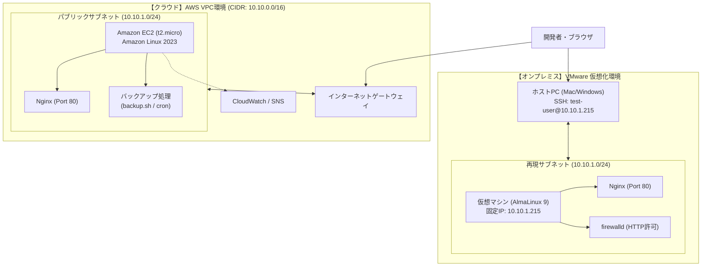
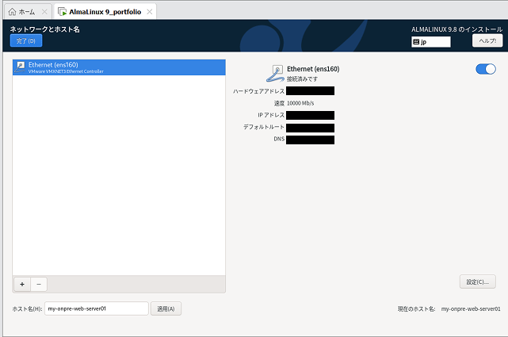
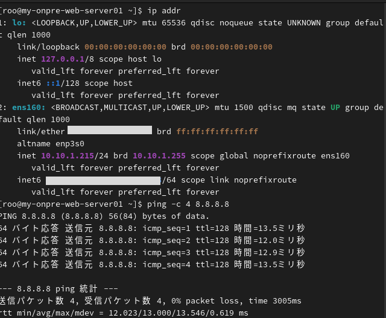
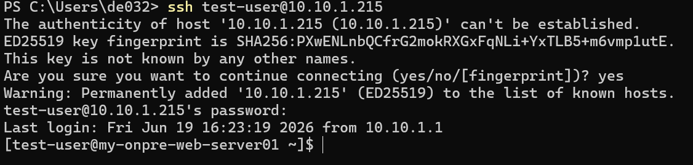
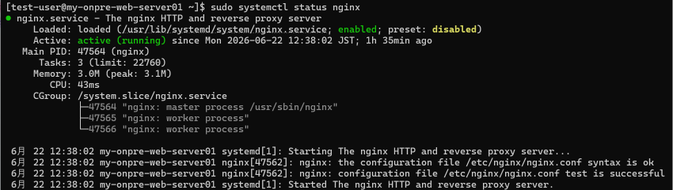
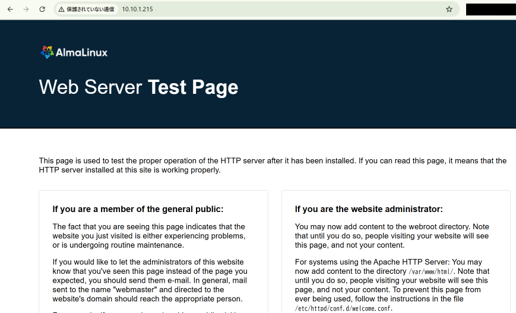

# 🚀 Webインフラ構築・運用保守 総合ポートフォリオ
## 〜 AWSクラウド ＆ オンプレミス（仮想化）ハイブリッド検証レポート 〜

本ドキュメントは、AWS（Amazon Web Services）環境での設計・構築と運用保守自動化の実績、およびそれらをローカル（オンプレミス）の仮想化環境（VMware / AlmaLinux 9）上で高精度に再現・比較検証したハイブリッドインフラ構築プロジェクトの全容を1つに統合した成果物レポートです。

---

## 📋 目次

- [1. 全体概要とプロジェクト目的](#1-全体概要とプロジェクト目的)
  - [1.1 プロジェクト概要](#11-プロジェクト概要)
  - [1.2 インフラ全体構成図（ハイブリッド構成）](#12-インフラ全体構成図ハイブリッド構成)
  - [1.3 クラウドとオンプレミスの機能対比表](#13-クラウドとオンプレミスの機能対比表)
  - [1.4 AWSクラウド環境の主要設計値](#14-awsクラウド環境の主要設計値)
  - [1.5 オンプレミス（仮想化）環境での検証目的](#15-オンプレミス仮想化環境での検証目的)
- [2. AWSクラウド環境の設計・構築](#2-awsクラウド環境の設計構築)
  - [2.1 ネットワーク環境の新規構築（VPC / Subnet / IGW）](#21-ネットワーク環境の新規構築vpc--subnet--igw)
  - [2.2 Webサーバーの土台構築（EC2 / IAMロール / セキュリティグループ）](#22-webサーバーの土台構築ec2--iamロール--セキュリティグループ)
  - [2.3 SSH接続とWebサーバー（Nginx）の導入・疎通確認](#23-ssh接続とwebサーバーnginxの導入疎通確認)
  - [2.4 ネットワーク疎通・システムリソースの稼働状態確認](#24-ネットワーク疎通システムリソースの稼働状態確認)
  - [2.5 運用保守の自動化（シェルスクリプトによる定時バックアップ実装）](#25-運用保守の自動化シェルスクリプトによる定時バックアップ実装)
  - [2.6 Amazon CloudWatchによるリソース監視・アラーム通知設定](#26-amazon-cloudwatchによるリソース監視アラーム通知設定)
- [3. オンプレミス（VMware）環境における再現・比較検証](#3-オンプレミスvmware環境における再現比較検証)
  - [3.1 ネットワーク設計および全体構成](#31-ネットワーク設計および全体構成)
  - [3.2 各ステップの構築手順と実施内容](#32-各ステップの構築手順と実施内容)
- [4. 総括とハイブリッド環境における習得スキル](#4-総括とハイブリッド環境における習得スキル)
  - [4.1 本プロジェクトの成果と設計意図](#41-本プロジェクトの成果と設計意図)
  - [4.2 証明される習得スキル](#42-証明される習得スキル)
  - [4.3 今後の展望](#43-今後の展望)

---

# 1. 全体概要とプロジェクト目的

## 1.1 プロジェクト概要
本プロジェクトでは、AWS上における仮想ネットワーク環境（VPC）の設計・構築から、EC2インスタンスによるWebサーバー（Nginx）の起動、保守自動化（バックアップスクリプト・cron定時実行）、およびAmazon CloudWatchによるシステム監視設定までを網羅した「AWSクラウドインフラ環境」を構築。

さらに、クラウド環境での設計思想をローカル（オンプレミス）の仮想化環境（VMware / AlmaLinux 9）上でシミュレーションし、クラウドとオンプレミスのハイブリッド環境におけるインフラ構築・運用の比較検証を実施しました。

## 1.2 インフラ全体構成図（ハイブリッド構成）

本プロジェクトで構築・検証したインフラの全体構成図です。AWS上のVPC環境と、VMware上の仮想化環境における設計的・技術的な対応関係を示しています。



## 1.3 クラウドとオンプレミスの機能対比表

AWSクラウド上の各インフラ構成要素と、オンプレミス（VMware）環境における技術的対応関係の一覧です。両環境の設計思想と差異を体系的に比較しています。

| 比較項目 | AWSクラウド環境 | オンプレミス（VMware）環境 | 技術的ポイント・設計意図 |
| :--- | :--- | :--- | :--- |
| **仮想化ホスト** | AWSマネージドインフラ | VMware Workstation (ローカル) | クラウドプロバイダ管理とローカルハイパーバイザの違い |
| **OS** | Amazon Linux 2023 | AlmaLinux 9.x | RedHat系・dnfパッケージ管理の親和性を担保 |
| **仮想ネットワーク** | VPC (Subnet: `10.10.1.0/24`) | VMware NATモード (Subnet: `10.10.1.0/24`) | クラウドVPCのIP設計をオンプレミス環境で忠実に再現 |
| **外部通信経路** | インターネットゲートウェイ (IGW) | 仮想ネットワークエディタ (NATゲートウェイ) | 外部とのインターネット接続およびルーティング制御 |
| **ファイアウォール** | セキュリティグループ (SG) | `firewalld` (OS内蔵) | クラウドの境界型防御とホストOS内部防御の対比 |
| **リモート管理** | SSM Session Manager / SSH | SSH接続 (一般ユーザー制限) | ルート直接ログインの禁止など、アクセス制限の徹底 |
| **Webサーバー** | Nginx (HTTP Port 80) | Nginx (HTTP Port 80) | 同一ミドルウェアを用いた稼動状況・設定プロセスの検証 |

## 1.4 AWSクラウド環境の主要設計値

| 項目 | 採用テクノロジー / 設計値 | 目的・特徴 |
| :--- | :--- | :--- |
| **仮想ネットワーク** | VPC (`10.10.0.0/16`) / パブリックサブネット (`10.10.1.0/24`) | セキュアで論理的に分離されたNW空間の確保 |
| **仮想サーバー** | Amazon EC2 (Amazon Linux 2023, t2.micro) | 動的なWebサイトをホストする中核インフラ |
| **Webサーバー** | Nginx (HTTP Port 80) | 高パフォーマンスで軽量なリバースプロキシ・Webサーバー |
| **アクセス管理** | SSH (Port 22: 送信元IP制限) & SSM Session Manager | 最小権限の原則に基づく安全なリモート管理 |
| **保守自動化** | Shell Script (`tar` バックアップ) & `cron` 定時実行 | 人的ミスを防ぐシステムバックアップ自動化 |
| **リソース監視** | Amazon CloudWatch Alarm & Amazon SNS (Email) | CPU過負荷検知および異常時の即時メール通知 |

## 1.5 オンプレミス（仮想化）環境での検証目的
AWS環境の専用OS「Amazon Linux 2023」の再現として、パッケージ構成やベースシステムが極めて近い「AlmaLinux 9」を採用。AWS側のVPC設計（`10.10.1.0/24`）をローカル側で完全にシミュレートし、固定IPアドレスの割り当て、ホストPCからの安全なSSHリモート接続、およびOS内ファイアウォールを制御したWebサーバー（Nginx）の導入までを実証しました。これにより、クラウドとオンプレミス双方のインフラ特性を深く理解し、適材適所のシステム設計ができる能力を養うことを目的としています。

---

# 2. AWSクラウド環境の設計・構築

## 2.1 ネットワーク環境の新規構築（VPC / Subnet / IGW）
本システムの土台となるAWS上のネットワーク環境（VPCおよびパブリックサブネット）を新規に構築しました。

### 1. ネットワーク設計値

| 項目（リソース） | 設定名（Nameタグ） | 設定値（CIDR等） |
| :--- | :--- | :--- |
| **VPC** | `my-network-vpc01` | `10.10.0.0/16` |
| **サブネット** | `my-public-subnet01` | `10.10.1.0/24` |
| **インターネットゲートウェイ** | `my-network-igw` | VPCへアタッチ済み |
| **ルートテーブル** | `my-public-rt` | 送信先 `0.0.0.0/0` ➡ IGW |

### 2. 構築手順と検証結果

#### ① VPC（仮想ネットワーク空間）の作成
AWS上に専用の仮想ネットワーク空間（VPC）を確保。将来の拡張性を考慮し、アドレス範囲は `10.10.0.0/16` に設計。


#### ② サブネット（公開ネットワーク区画）の作成
VPC内部にWebサーバーを配置するための公開エリア（パブリックサブネット）を `10.10.1.0/24` の範囲で作成。


#### ③ インターネットゲートウェイの接続
外部インターネットとの通信経路を確保するため、インターネットゲートウェイを新規作成しVPCへアタッチ。


#### ④ ルートテーブルの設定とサブネットの関連付け
ルートテーブルを新規作成し、デフォルトルート（`0.0.0.0/0`）宛ての通信先としてインターネットゲートウェイを設定。その後、このルートテーブルをサブネットに関連付けることでパブリックサブネットとして有効化。


---

## 2.2 Webサーバーの土台構築（EC2 / IAMロール / セキュリティグループ）
Webサーバーを配置するための仮想サーバー（EC2）の構築、および安全な運用のためのセキュリティ設定（キーペア、セキュリティグループ、IAMロール）を完了しました。

### 1. 構築内容一覧

| 項目 | リソース名 / 設定値 | 役割 / 目的 |
| :--- | :--- | :--- |
| **仮想サーバー** | `my-network-web-server01` | 成果物をデプロイするWEBサーバー本体（Amazon Linux 2023 / t2.micro） |
| **キーペア** | `my-network-key01` | サーバーへ安全にSSH接続するための秘密鍵（RSA / .pem形式） |
| **ファイアウォール** | `my-network-sg01` | サーバーへの通信を制御するセキュリティグループ。必要最低限のポートのみ開放 |
| **IAMロール** | `my-network-ec2-role01` | セッションマネージャー（SSM）を利用して、鍵なしで安全にリモート管理するための権限 |

### 2. セキュリティグループ（インバウンドルール）の設計
実務のベストプラクティスに基づき、管理用通信には厳格な接続制限を設定。
* **SSH（ポート: 22）**: ソースを「マイIP（自身の接続元IPアドレス）」に制限し、外部からの不正アクセスや総当たり攻撃（ブルートフォースアタック）を遮断。
* **HTTP（ポート: 80）**: Webサイト一般公開のため、ソースを「`0.0.0.0/0`（Anywhere）」に設定し開放。

### 3. セキュリティと運用の最適化：SSMセッションマネージャー（IAMロール）の導入
本構築では、一般的なキーペア認証だけでなく、実務の現場で標準的に採用されている **AWS Systems Manager（SSM）セッションマネージャー** による接続を見据えた設計を実施。
* **付与した管理ポリシー**: `AmazonSSMManagedInstanceCore`
* **導入のメリット**:
  1. インターネット上にSSHポート（22番）を常時開放する必要がなくなり、セキュアなインフラ運用が可能になる。
  2. 万が一、キーペア（秘密鍵）を紛失・漏洩した場合でも、AWSコンソールから安全かつ統合的にサーバーをリモート操作できる状態を維持。

### 4. 構築エビデンス（スクリーンショット）

#### ① キーペア作成
セキュリティ確保のため、RSAアルゴリズムを用いて鍵を生成し、プライベートファイルとして安全にダウンロード。


#### ② セキュリティグループ設定
SSHポート（22）のソースIPを「マイIP」に制限し、HTTP（80）のみ全開放として安全な接続条件を確立。


#### ③ EC2インスタンスのネットワーク設定とIAMロールの付与
VPCおよびサブネットとEC2インスタンスを正確に紐づけ、事前に作成した `AmazonSSMManagedInstanceCore` ポリシーを含むIAMロール（`my-network-ec2-role01`）をEC2へアタッチ。


#### ④ EC2インスタンス起動完了
作成したすべてのセキュリティ・ネットワーク設定を反映したEC2インスタンスが、正常に「実行中」ステータスになったことを確認。


---

## 2.3 SSH接続とWebサーバー（Nginx）の導入・疎通確認
構築したEC2インスタンス環境へターミナルから安全にSSHログインし、Webサーバー（Nginx）のインストール・サービス起動、およびブラウザからの一般公開アクセス（HTTP: 80ポート）の疎通確認テストを完了しました。

### 1. 構築・設定コマンドと実行手順

#### ① SSH接続とアクセス権変更
秘密鍵ファイルのパーミッションを適切に制限し、セキュアなリモートアクセス経路を確立。
```bash
chmod 400 "my-network-key01 .pem"
ssh -i "my-network-key01 .pem" ec2-user@16.176.141.215
```


#### ② OSパッケージ更新
OSのシステムパッケージを最新の状態にアップデートし、セキュリティと安定性を確保。
```bash
sudo dnf update -y
```

#### ③ ミドルウェア（Nginx）導入
パッケージ管理ツール（dnf）を用いて、WebサイトをホスティングするためのNginxサーバーを導入。
```bash
sudo dnf install nginx -y
```

#### ④ サービス起動と自動起動（Enabled）設定
Nginxサービスを起動。あわせてサーバー再起動時にも自動でサービスが立ち上がるよう自動起動（enable）を設定。
```bash
sudo systemctl start nginx
sudo systemctl enable nginx
```

#### ⑤ 疎通確認（HTTP）
パブリックIP（`16.176.141.215`）経由でブラウザから疎通テストを実行。

### 2. インフラ運用における実務意識とベストプラクティス
* **最小権限の原則（Least Privilege）の徹底**:
  LinuxやMac環境において、秘密鍵ファイル（`.pem`）の権限が過剰に開放されている（他ユーザーが読める）状態では、セキュアでないと判断されSSH接続が拒否されます。今回は `chmod 400` を実行し、「所有者のみが読み取り可能」という最小権限を厳格に適用。ファイル名に半角スペースが含まれる特殊なケースに対しても、ダブルクォーテーションでエスケープ処理を行うことで正確なパーミッション制御を行いました。

### 3. 検証エビデンス（確認コマンド・ステータス）

#### ① Nginx 起動ステータスおよび自動起動設定の確認
ターミナルで `sudo systemctl status nginx` を実行し、以下の稼働ステータスを確認。
```text
nginx.service - The nginx HTTP and reverse proxy server
Loaded: loaded (/usr/lib/systemctl/system/nginx.service; enabled; vendor preset: disabled)
Active: active (running) since YYYY-MM-DD HH:MM:SS JST; 5min ago
```
- **`active (running)`** の表示により、Webサーバーのプロセスが正常に常駐・稼働していることを実証。
- **`enabled`** の表示により、AWS側のEC2インスタンス再起動やメンテナンスによるOSシャットダウンが発生した場合でも、自動的にWebサービスが復旧する設定が有効化されていることを確認。


#### ② ブラウザからのHTTP疎通確認
自身の端末のWebブラウザ（Chrome）から `http://16.176.141.215/` にアクセスし、Nginxのデフォルトウェルカムページ（`Welcome to nginx!`）が表示されることを確認。


この疎通確認の成功により、以下のインフラ要素が正常に連携できていることが実証されました。
- インターネットゲートウェイ（IGW）からパブリックサブネットへのルーティング
- セキュリティグループのインバウンドルール（HTTP: 80ポート）の通信許可設定
- EC2上のOS（Amazon Linux 2023）内でのパケット受信とNginxプロセスへの正常な受け渡し

---

## 2.4 ネットワーク疎通・システムリソースの稼働状態確認
稼働開始したサーバーの運用初期段階における動作の健全性を担保するため、各種コマンドによるネットワークおよびシステムリソース（CPU、メモリ、ストレージ）の状態確認を行いました。

### 1. サーバー接続確認 (SSH接続)
動的にパブリックIPが変更されたケースを想定し、EC2インスタンスへのログインが継続して行えるか検証。正常にログイン完了を確認。


### 2. 外部ネットワーク疎通確認 (ping)
サーバーから外部のパブリックDNSサーバーに向けて `ping` コマンドを実行し、インターネット接続が健全か確認。パケット損失 0% で正常に往復疎通できていることを確認。
```bash
ping -c 4 8.8.8.8
```


### 3. システムリソース状態確認 (df / free)

#### ① ディスク容量の確認 (`df -h`)
ルートストレージの使用率が過度に逼迫していないか確認。メインディスクの使用率は 21%（空き 6.3GB）と十分な余剰スペースがあることを確認。
```bash
df -h
```


#### ② メモリ使用量の確認 (`free -m`)
メモリ残量がシステム動作を阻害しないかチェック。実質利用可能な空き容量（available）が 670MB 確保されていることを確認。
```bash
free -m
```


### 4. Webサーバー稼働状態確認 (Nginx)
ミドルウェアのダウンタイムが発生していないかをプロセスサービス情報から確認。ステータスが `Active: active (running)` であることを確認。
```bash
sudo systemctl status nginx
```


---

## 2.5 運用保守の自動化（シェルスクリプトによる定時バックアップ実装）
システムの安定運用と重要な構成データの保護を目的とした「バックアップの自動化」を設計・構築しました。手動運用のコストを削減し、権限管理やタスクスケジューリングを考慮した、実務に即した高信頼なインフラ保守環境を実現しています。

### 1. 構築内容・実施項目

#### ① 安全なバックアップ専用ディレクトリの設計と権限管理
- セキュリティと運用の分離を考慮し、専用のバックアップ保存先として `/var/backup` ディレクトリを作成。
- 初期作成時に発生した管理者（root）所有権による一般ユーザー（`ec2-user`）の書き込み拒否エラー（`Permission denied`）を特定。
- 所有権を適切に変更（`chown`）し、最小権限の原則に則った安全なファイル書き込み処理を担保。

#### ② シェルスクリプトによる自動バックアップ処理の実装 (`backup.sh`)
- Webサーバー（Nginx）の設定フォルダ（`/etc/nginx`）を対象とした圧縮アーカイブ（`.tar.gz`）の自動生成スクリプトを作成。
- 日付自動付与機能（`date +%Y%m%d` コマンドの動的組み込み）を実装し、世代管理（過去のバックアップを上書きしない仕組み）に対応。

#### ③ cronによる定時自動実行（タスクスケジューリング）の設定
- Linuxの定時実行タスク（`crontab`）へスケジュールを登録。
- システム負荷の低い深夜時間帯（毎日午前3時00分）に完全自動でバックアップが稼働する仕組みを構築。

### 2. 作成したスクリプトと設定

#### 📄 バックアップスクリプト (`backup.sh`)
```bash
#!/bin/bash
# バックアップを保存するフォルダ
BACKUP_DIR="/var/backup"
# 保存するファイル名（日付を自動挿入）
BACKUP_FILE="nginx_backup_$(date +%Y%m%d).tar.gz"

# バックアップを実行（Nginxの設定フォルダを固める）
tar -czf "$BACKUP_DIR/$BACKUP_FILE" /etc/nginx

echo "Backup completed: $BACKUP_FILE"
```

#### 📄 crontab設定
```text
0 3 * * * /bin/bash /home/ec2-user/backup.sh >> /home/ec2-user/backup.log 2>&1
```

### 3. 検証・自動実行エビデンス

#### ① バックアップ実行のログ出力確認
スクリプトが正常に実行され、ログに `Backup completed: nginx_backup_YYYYMMDD.tar.gz` と出力されている様子を確認。


#### ② バックアップアーカイブファイルの生成確認
指定ディレクトリ `/var/backup` 内に、日付付きのアーカイブファイルが生成されていることを確認。


#### ③ アーカイブデータの中身検証
圧縮されたアーカイブの中に、Nginxの設定ファイル（`/etc/nginx` 配下）が漏れなく格納されているかを `tar -tf` コマンドで確認。


#### ④ crontabスケジュール登録の確認
`crontab -l` コマンドを実行し、毎日午前3時にスクリプトが実行されるタスクスケジュールがシステムに正しく認識されていることを確認。


---

## 2.6 Amazon CloudWatchによるリソース監視・アラーム通知設定
構築したWebサーバー（Amazon EC2）の運用・監視体制を確立するため、**Amazon CloudWatch**および**Amazon SNS**を用いたリソース監視（CPU使用率）と異常時のメール通知仕組みを構築しました。

### 1. 実施作業内容

1. **CloudWatch アラームの作成**
   - 対象EC2インスタンスの `CPUUtilization`（CPU使用率）メトリクスを監視対象に設定。
   - 閾値として「80%以上が1期間（5分）継続した場合」をアラーム状態（異常）のトリガーに指定。
2. **Amazon SNSによる通知連携**
   - 新規のSNSトピック（`EC2-CPU-Alert-Topic`）を作成。
   - アラーム発生時に指定の管理者メールアドレスへリアルタイムに通知を送信するようサブスクリプションを構成。
3. **通知サブスクリプションの購読承認**
   - AWSから自動送信される承認メールを確認し、購読（Subscription）を正常にアクティベート。
4. **ステータス監視の有効化検証**
   - アラーム状態が正常に初期化され、「OK」ステータスとしてEC2リソースの常時監視が開始されたことを確認。

### 2. 構築・検証エビデンス（作業証跡）

#### ① 監視メトリクスの選択
EC2インスタンス固有のCPU使用率メトリクス（`CPUUtilization`）を正確にマッピング。


#### ② アラーム閾値の静的設定
CPU使用率が80%を超えた段階でアラーム状態に遷移するよう、静的しきい値を設定（グラフ上の赤破線と連動）。


#### ③ Amazon SNS 通知アクションの設定
アラーム発生時のアクションとして、通知トピックの作成と配信先メールアドレスの紐付けを実施。


#### ④ SNSサブスクリプションの購読承認（Subscription Confirmation）
指定したメールアドレス宛に届いたAWSからの承認メール内の確認リンクを展開し、通知配信の有効化（Confirmed）を完了。


#### ⑤ アラームの正常稼働確認（OKステータス）
初期化が完了し、現在のリソース状態が閾値未満（正常）であることを示す「OK」ステータスへの遷移を確認。


---

# 3. オンプレミス（VMware）環境における再現・比較検証

## 3.1 ネットワーク設計および全体構成
AWS上のVPCネットワーク環境をローカルへシミュレートするために作成した、ネットワーク設計の詳細です。

| 項目 | 設定値 | 備考 / 目的 |
| :--- | :--- | :--- |
| **対象ゲストOS** | AlmaLinux 9.x (x86_64) | Amazon Linux 2023 互換環境として選定 |
| **ネットワークモード** | VMware NATモード | 外部インターネット接続を維持 |
| **再現サブネット** | 10.10.1.0/24 | AWS側のVPC環境に対応 |
| **仮想マシン固定IP** | 10.10.1.215 | AWSパブリックIPの末尾と統一 |
| **ゲートウェイ IP** | 10.10.1.2 | VMware 仮想ネットワークエディタ側で定義 |
| **DNS サーバー** | 8.8.8.8 | Google Public DNS |

---

## 3.2 各ステップの構築手順と実施内容

### ステップ1：仮想マシンの作成とOSインストール
* **仮想マシンの作成**: VMware Workstationにて「標準（推奨）」ウィザードを選択し、ディスク容量として `50GB（単一ファイル）` を割り当て。
* **初期設定**: 言語設定を「日本語」、タイムゾーンを「Asia/Tokyo」に指定。
* **ホスト名設定**: AWSのインスタンス名に対応する `my-onpre-web-server01` に変更し、ネットワーク（イーサネット）を有効化。



### ステップ2：ネットワークの固定IPアドレス化と疎通確認
自動割当（DHCP）によるIP変動を防ぎ、AWSの構成とリンクさせるため、静的（スタティック）なIPアドレス運用へ変更。

1. **仮想ネットワークエディタの設定（ホストPC側）**
   * NATのサブネットIP: `10.10.1.0`
   * ゲートウェイIP: `10.10.1.2`
2. **ゲストOS（AlmaLinux 9）の設定**
   * `nmtui` を起動し、IPv4設定を「手動（Manual）」に切り替え。
   * **IPアドレス**: `10.10.1.215/24`
   * **ゲートウェイ**: `10.10.1.2`
   * **DNSサーバー**: `8.8.8.8`
   
3. **反映と確認**
   * 設定反映のため OSを再起動 (`sudo reboot`)。
   * `ip addr` および `ping -c 4 8.8.8.8` により、IPの固定化と外部インターネットへの疎通（パケット損失0%）を確認。
   
   

### ステップ3：SSH接続の確立（ホストPCからの遠隔操作）
AWSのEC2インスタンス運用をローカル環境で再現。
* **セキュリティの遵守**: 初期仕様である「rootユーザーの直接SSHログイン禁止」に対応するため、作業用一般ユーザー（`test-user`）を事前に作成。
* **リモートログイン**: ホストPCのターミナルから `ssh test-user@10.10.1.215` を実行。遠隔から仮想マシンのプロンプト（`[test-user@my-onpre-web-server01 ~]$`）の取得に成功。
 


### ステップ4：Webサーバー（Nginx）の導入とファイアウォール解除
AWSのEC2内で実施した「Nginxの導入」手順と同一のコマンドラインを用い、機能の有効化を実施。

1. **Nginxのインストールと起動**
   * パッケージ更新: `sudo dnf update -y`
   * インストール: `sudo dnf install nginx -y`
   * 起動＆自動起動設定: `sudo systemctl start nginx` / `sudo systemctl enable nginx`
   
   

2. **ファイアウォール制御（セキュリティグループの再現）**
   * OS内蔵ファイアウォール（`firewalld`）を制御し、HTTP通信（80番ポート）を恒久的に許可。
     ```bash
     sudo firewall-cmd --add-service=http --permanent
     sudo firewall-cmd --reload
     ```
3. **ブラウザ疎通確認**
   * ホストPCのブラウザから `http://10.10.1.215/` にアクセスし、「Welcome to nginx!」の正常な応答を確認。



> 💡 **トラブルシューティング：一般ユーザーへの権限付与**
> 一般ユーザー（`test-user`）の権限不足（*not in the sudoers file*）に対し、安全な特権設定コマンドである `visudo` を使用。`/etc/sudoers` に特権許可を直接追記する実務に則ったエラーハンドリングにより、権限エラーを解決。

---

# 4. 総括とハイブリッド環境における習得スキル

## 4.1 本プロジェクトの成果と設計意図
本インフラ構築および運用保守自動化プログラムを通じて、AWS上でのセキュアなWebシステム基盤の構築実績を上げました。特に以下の設計アプローチは、実務レベルを意識した構成となっています。

1. **SSMセッションマネージャーによるセキュア管理**: SSHポートを一般公開せず、AWS IAM権限で制御。
2. **所有権・最小権限の管理**: バックアップディレクトリのパーミッションや秘密鍵ファイルの権限に配慮した設計。
3. **継続的なシステム信頼性の担保**: シェルスクリプトによる世代管理バックアップと定時実行の自動化。
4. **リアルタイムな障害検知システム**: CloudWatchアラームとSNS通知の統合連携。

また、それらをローカル環境（VMware / AlmaLinux 9）に移植し、IP固定化やOSファイアウォール（`firewalld`）制御を行うことで、AWSセキュリティグループとOS標準ファイアウォールの違いやネットワーク設計をより深く体系的に理解しました。

## 4.2 証明される習得スキル

* **クラウド（AWS）設計・構築スキル**
  VPCネットワーク設計、EC2構築、IAMによる最小特権設計、CloudWatch / SNSによる監視運用の統合設計能力。
* **ハイブリッド環境における設計・構成把握能力**
  AWSのクラウド設計（セキュリティグループ）とオンプレミスのサーバー設計（firewalld・OS内設定）の違いを正しく理解し、ネットワークの矛盾を生じさせることなくローカル環境に落とし込める構成管理能力。
* **実務レベルのエラーハンドリングスキル**
  Linuxシステム構築時の代表的な権限不備に対して、原因の特定から `visudo` や `chown` を用いた設定ファイル・ディレクトリの安全な変更まで、実務標準のフローに沿って自力でトラブルを解決できる応用力。
* **Webインフラ基盤の構築・運用保守の自動化**
  OSの初期インストールから、静的ネットワークの制御、遠隔保守（SSH）環境の確立、Webサービスの常駐化、セキュリティ制御（ファイアウォール解除）、シェルスクリプト＆cronによる定時バックアップ自動化にいたるまで、サーバー運用の一連のインフラライフサイクルを完遂できる確かな技術力。

## 4.3 今後の展望
今後は、構築したシングルサーバー環境から発展させ、実務における高可用性・耐障害性・セキュリティをさらに向上させるための以下の取り組みを検討します。

- **高可用性（HA）化**: ALB（Application Load Balancer）と複数AZのサブネットにEC2を冗長配置（マルチAZ構成）し、オートスケーリング（Auto Scaling）による負荷連動型の拡張性を実装。
- **監視の高度化**: CloudWatch AgentをEC2内に導入し、OSの標準メトリクスでは取得できない「メモリ使用率」や「ディスク残量」のカスタムメトリクス化と閾値アラーム設計。
- **データ保護の拡充**: Nginxの設定ファイルだけでなく、Webコンテンツディレクトリ（`/usr/share/nginx/html`等）のバックアップ、および定期的なAmazon S3へのライフサイクル付き自動アップロードへの拡張。
